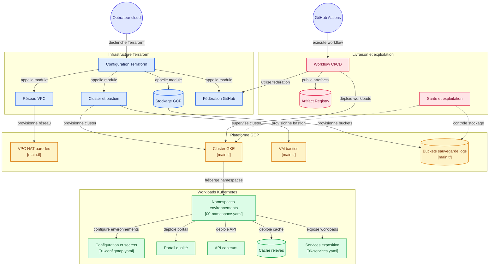

# FoodTrack — équipe C

Projet final — Ingénieur Cloud OPS — DevOps multicloud.
Projet Google Cloud : `foodtrack-equipe-c` · Région : `europe-west2` · Entrepôt : Londres.

> Énoncé complet : [`projet-final/CAHIER_DES_CHARGES.html`](projet-final/CAHIER_DES_CHARGES.html)
> Grille de soutenance : [`projet-final/GRILLE_SOUTENANCE.html`](projet-final/GRILLE_SOUTENANCE.html)

## Équipe et rôles

| Rôle | Domaine | Porte aussi | Membre |
|---|---|---|---|
| Lead infrastructure | VPC, NAT, cluster, bastion, buckets, modules Terraform | Documentation d'architecture | _à compléter_ |
| Lead Kubernetes | Manifestes, namespaces, configuration par environnement, exposition, mise à l'échelle | | _à compléter_ |
| Lead livraison | Dépôt, workflow GitHub Actions, Artifact Registry, versions et releases | | _à compléter_ |
| Lead exploitation | Supervision, alertes, IAM, durcissement, scripts, coûts | Script Python de contrôle de santé | _à compléter_ |

(Équipe de 4 : pas de rôle Coordination dédié — la documentation d'architecture revient au Lead infrastructure, le script de santé au Lead exploitation.)

## Structure du dépôt

```
terraform/            racine Terraform : backend gcs, variables, modules
  modules/
    reseau/            vpc, sous-reseau, cloud router, cloud nat, pare-feu
    compute/           cluster gke, node pool, vm bastion
    stockage/          buckets de sauvegarde et d exports de journaux
    wif-github/         federation d identite GitHub Actions -> Google Cloud (fourni)
  dev.tfvars / test.tfvars / prod.tfvars

labs/projet-final/     ressources fournies par le formateur (point de depart)
  manifests/            manifestes Kubernetes de depart (namespace unique)
  terraform-fourni/     module WIF original tel que fourni
  ci/                    squelette de workflow GitHub Actions

manifests/              (a creer) manifestes organises par environnement
  dev/ test/ prod/       ou base/ + overlays/ si Kustomize

.github/workflows/     pipeline CI/CD

projet-final/          cahier des charges et grille de soutenance (reference)
assets/                 logos et schemas
```

## Phase 1 Terraform


Socle Google Cloud de l'entrepôt de Londres, dans le projet `foodtrack-equipe-c`, exclusivement en `europe-west2` (`europe-west2-b` pour les ressources zonales).

### Architecture



Un seul cluster hébergera en phase 2 les namespaces `foodtrack-dev`, `foodtrack-test` et `foodtrack-prod`. Les nœuds n'ont aucune IP externe ; Cloud NAT couvre la plage primaire et les deux plages secondaires.

### Nommage du groupe C

| Ressource | Nom |
|---|---|
| Projet | `foodtrack-equipe-c` |
| Région / zone | `europe-west2` / `europe-west2-b` |
| VPC | `foodtrack-c-vpc` |
| Sous-réseau | `foodtrack-c-subnet` |
| Cluster | `foodtrack-c-cluster` |
| Node pool | `foodtrack-c-pool` |
| Bastion | `foodtrack-c-bastion` |
| Dépôt Docker | `foodtrack-c-images` |
| Backend | `foodtrack-c-tfstate-foodtrack-equipe-c` |

### Dimensionnement initial

Le profil `dev.tfvars` démarre avec un nœud `e2-standard-2`, un disque de démarrage `pd-standard` de 50 Go et un autoscaling de 0 à 2 nœuds. C'est un point de départ économique à confirmer après addition des `resources.requests` des trois applications et des composants système. Les profils `test.tfvars` et `prod.tfvars` redimensionnent **le même cluster** ; ils ne créent jamais de second cluster.

### Création unique du backend

Le bucket d'état est la seule ressource créée hors Terraform, car il doit exister avant `terraform init` :

```bash
export EQUIPE="c"
export REGION="europe-west2"
export ZONE="europe-west2-b"
export PROJECT="poei-formation-gcp"

gcloud config set project "$PROJECT"
gcloud config set compute/region "$REGION"
gcloud config set compute/zone "$ZONE"
gcloud storage buckets create \
  "gs://foodtrack-c-tfstate-foodtrack-equipe-c" \
  --location="$REGION" \
  --uniform-bucket-level-access
gcloud storage buckets update \
  "gs://foodtrack-c-tfstate-foodtrack-equipe-c" \
  --versioning
```

### Déploiement de la phase 1

Remplacer d'abord le CIDR de documentation `203.0.113.10/32` dans les trois `.tfvars` par l'adresse publique `/32` de l'équipe.

```bash
terraform init
terraform fmt -check -recursive
terraform validate
terraform plan -var-file=dev.tfvars -out=phase1.tfplan
terraform apply phase1.tfplan
```

Vérifications :

```bash
terraform plan -var-file=dev.tfvars
gcloud container clusters get-credentials "foodtrack-c-cluster" --zone "europe-west2-b"
kubectl get nodes -o wide
gcloud compute routers nats list --router "foodtrack-c-router" --region "europe-west2"
gcloud container node-pools describe "foodtrack-c-pool" \
  --cluster "foodtrack-c-cluster" \
  --zone "europe-west2-b" \
  --format="value(config.diskType,config.diskSizeGb,config.machineType)"
```

La dernière commande doit afficher `pd-standard`, `50` et `e2-standard-2`. Les nœuds ne doivent présenter aucune IP externe.

### Compromis d'accès au plan de contrôle

Le cahier des charges prépare des runners GitHub hébergés aux adresses variables. Le profil ouvre donc le endpoint public Kubernetes avec `master_authorized_networks_config = 0.0.0.0/0`. Cette ouverture ne contourne pas l'authentification IAM/Kubernetes, mais agrandit fortement la surface réseau exposée.

Alternative recommandée : endpoint privé et runner GitHub auto-hébergé sur le bastion ou dans le VPC. Une autre option est le endpoint DNS GKE avec IAM et Workload Identity Federation. Ce compromis doit être réévalué en phase 3.

### Cycle de vie et coûts

- `min_node_count = 0` permet l'extinction du node pool le soir ; l'automatisation sera ajoutée dans une phase ultérieure.
- La protection contre la suppression du cluster est activée. Pour le démantèlement final, passer temporairement `deletion_protection` à `false`, appliquer, puis lancer `terraform destroy`.
- `force_destroy_buckets` n'est activé que dans le profil dev.
- Ne jamais appliquer plusieurs profils avec des backends distincts : ils pilotent tous le cluster unique.
- Ne versionner ni état, ni plan, ni secrets.

