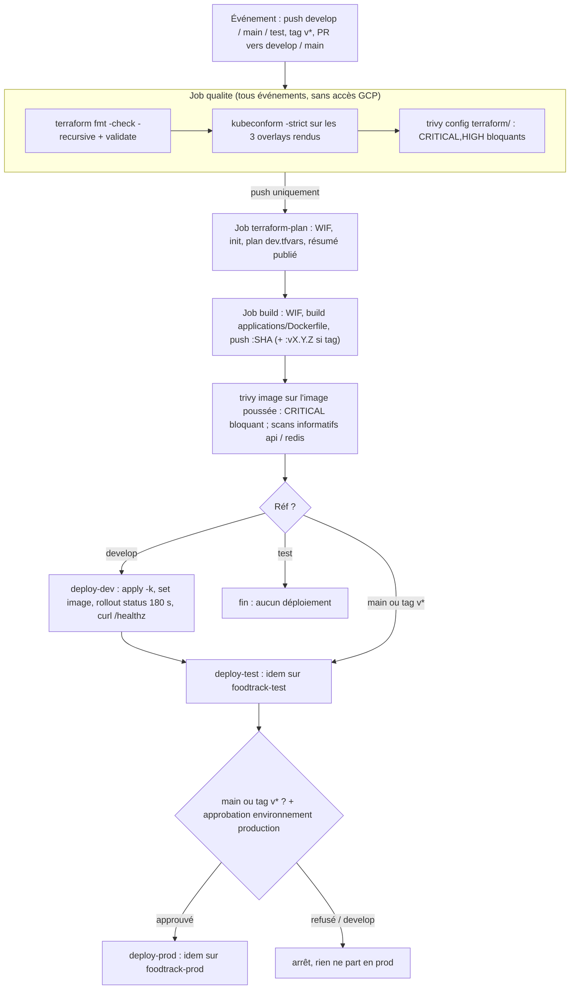

# FoodTrack - Équipe C - Plateforme HACCP sur Google Cloud

> **Formation** : Ingénieur Cloud OPS - Projet final DevOps multicloud
> **Équipe** : C · **Entrepôt** : Londres · **Région** : `europe-west2` (zone `europe-west2-b`)
> **Projet Google Cloud** : nom théorique `foodtrack-equipe-c` ; projet réellement attribué et utilisé dans le code : `form-gke-eleve03-a8e9` (voir [§ 16](#16-limites-connues-et-pistes))
> **Dépôt** : <https://github.com/MaelCrestin/foodtrack-equipe-c>
> **Références** : [Cahier des charges](projet-final/CAHIER_DES_CHARGES.html) · [Grille de soutenance](projet-final/GRILLE_SOUTENANCE.html)

FoodTrack collecte en continu les températures des camions et entrepôts pour prouver la conformité HACCP de la chaîne du froid. L'application (portail nginx, API capteurs, cache Redis) nous est fournie sous forme de prototype. Notre travail : la passer en production sur Google Cloud - infrastructure Terraform, trois environnements isolés sur un cluster GKE unique, livraison continue GitHub Actions sans clé, supervision, sécurisation et maîtrise du coût.

Ce document est écrit pour qu'un tiers puisse reprendre le projet sans l'équipe. Toute affirmation technique renvoie au fichier qui la prouve. 
---

## Table des matières

1. [En-tête](#foodtrack--équipe-c--plateforme-haccp-sur-google-cloud)
2. [Équipe et rôles](#2-équipe-et-rôles)
3. [Architecture](#3-architecture)
4. [Choix techniques et arbitrages](#4-choix-techniques-et-arbitrages)
5. [Dimensionnement chiffré](#5-dimensionnement-chiffré)
6. [Prérequis](#6-prérequis)
7. [Déploiement depuis zéro](#7-déploiement-depuis-zéro)
8. [Configuration par environnement](#8-configuration-par-environnement)
9. [Chaîne CI/CD](#9-chaîne-cicd)
10. [Stratégie de versions et de release](#10-stratégie-de-versions-et-de-release)
11. [Supervision](#11-supervision)
12. [Sécurité - audit écrit](#12-sécurité--audit-écrit)
13. [Scripts d'exploitation](#13-scripts-dexploitation)
14. [Analyse de coût](#14-analyse-de-coût)
15. [Cycle de vie Terraform](#15-cycle-de-vie-terraform)
16. [Limites connues et pistes](#16-limites-connues-et-pistes)


--- 
## Structure du dépôt

```
.
├── .github/workflows/deploy.yml     # pipeline : qualite, plan, build+scan, dev, test, prod (approbation)
├── .gitignore                       # *.env, .terraform/, *.tfstate*, *.tfplan, .terraform.lock.hcl
├── .trivyignore                     # exceptions trivy config (AVD-GCP-0061, AVD-GCP-0031), justifiées
├── .trivyignore-image               # exception trivy image (CVE-2026-6653), justifiée et datée
├── README.md                        # ce document
├── applications/Dockerfile          # image portail-qualite = nginx:1.30.5 + labels OCI
├── manifests/
│   ├── base/                        # socle Kustomize commun
│   │   ├── kustomization.yaml       # ressources + label app.kubernetes.io/part-of
│   │   ├── storageclass.yaml        # foodtrack-hdd : pd-standard, WaitForFirstConsumer
│   │   ├── configmap.yaml           # foodtrack-config : nginx default.conf (/healthz, /api/), index.html
│   │   ├── deployment-portail.yaml  # nginx, probes /healthz
│   │   ├── deployment-api.yaml      # hello-app, requests CPU (HPA), env depuis ConfigMap/Secret
│   │   ├── statefulset-cache.yaml   # redis AOF, fsGroup 999, volumeClaimTemplate foodtrack-hdd
│   │   ├── services.yaml            # ClusterIP (+ NEG sur le portail), headless pour redis
│   │   ├── ingress.yaml             # Ingress GCE /* -> portail-qualite:8080
│   │   ├── hpa.yaml                 # HPA api-capteurs (valeurs surchargées par overlay)
│   │   └── secret-example.yaml      # exemple factice, NON référencé par kustomization.yaml
│   └── overlays/{dev,test,prod}/    # namespace, patchs ConfigMap / HPA / stockage,
│                                    # secretGenerator (secret.env hors dépôt) ; prod : répliques + IP fixe
├── scripts/
│   ├── sauvegarde.sh                # archive horodatée -> bucket de sauvegardes
│   ├── purge-logs.sh                # purge des exports de journaux > 30 jours
│   ├── extinction-cluster.sh        # node pool à 0 (soir) / 2 (matin)
│   └── healthcheck.py               # contrôle de santé de l'API, codes de sortie 0/1/2
├── terraform/
│   ├── version.tf                   # Terraform >= 1.5, google ~> 8.3
│   ├── main.tf                      # backend GCS, provider, API, appels des modules
│   ├── variables.tf / outputs.tf    # entrées validées, sorties (WIF, IP prod, buckets…)
│   ├── dev.tfvars test.tfvars prod.tfvars   # identiques (infrastructure mutualisée)
│   ├── phase3-monitoring.tf         # IP fixe prod + appel du module monitoring
│   ├── phase3-wif-extra.tf          # droits complémentaires du SA CI pour terraform plan
│   └── modules/
│       ├── reseau/                  # VPC, sous-réseau + plages secondaires, router, NAT, pare-feu SSH
│       ├── compute/                 # SA nœuds, cluster, node pool, bastion, Artifact Registry
│       ├── stockage/                # buckets sauvegardes / journaux, puits de journaux
│       ├── monitoring/              # canal courriel, uptime check, alerte, métrique, dashboard
│       └── wif-github/              # module FOURNI (pool, fournisseur, SA, liaison), inchangé
├── labs/projet-final/               # RÉFÉRENCE FOURNIE par le formateur (manifestes de départ,
│                                    # squelette CI, module WIF) - pas du travail de l'équipe
├── projet-final/                    # cahier des charges et grille (supports formateur)
└── assets/                          # visuels et logos des supports formateur, non utilisés par le code
```


---

## 2. Équipe et rôles

Équipe de quatre : pas de rôle Coordination. Conformément au cahier des charges, la documentation d'architecture revient au lead infrastructure et le script de contrôle de santé au lead exploitation.

| Rôle | Membre | Domaine porté en soutenance | Fichiers principaux |
|---|---|---|---|
| Lead infrastructure (+ doc d'architecture) | `[Feyza BUDAK]` | VPC, NAT, cluster, bastion, buckets, modules Terraform, schéma | `terraform/`, § 3–5, § 15 |
| Lead Kubernetes | `[Jade COCHET]` | Manifestes, namespaces, config par environnement, Ingress, HPA, StorageClass | `manifests/`, § 8 |
| Lead livraison | `[Aïssatou CAMARA]` | Dépôt, workflow GitHub Actions, Artifact Registry, versions et releases | `.github/workflows/deploy.yml`, `applications/Dockerfile`, § 9–10 |
| Lead exploitation (+ script de santé) | `[Mael CRESTIN]` | Supervision, alertes, IAM, durcissement, scripts, coûts | `terraform/modules/monitoring/`, `scripts/`, § 11–14 |

---

## 3. Architecture

### 3.1 Schéma

```mermaid
flowchart TD

subgraph group_infra["Cloud infrastructure"]
  node_terraform["Terraform root<br/>[main.tf]"]
  node_network["VPC and NAT<br/>[main.tf]"]
  node_compute["GKE and bastion<br/>[main.tf]"]
  node_storage["Backup storage<br/>[main.tf]"]
  node_gke["GKE cluster<br/>[main.tf]"]
end

subgraph group_delivery["Delivery and identity"]
  node_workflow["Delivery workflow<br/>[deploy.yml]"]
  node_wif["GitHub federation<br/>[main.tf]"]
  node_registry[("Image registry")]
end

subgraph group_kube["Kubernetes workloads"]
  node_base["Workload base<br/>[kustomization.yaml]"]
  node_overlays["Environment overlays<br/>[kustomization.yaml]"]
  node_portal["Quality portal"]
  node_api["Sensor API"]
  node_cache[("Readings cache")]
  node_exposure["Ingress and services<br/>[ingress.yaml]"]
  node_scaling["Autoscaling<br/>[hpa.yaml]"]
end

subgraph group_ops["Operations"]
  node_monitoring["Cloud monitoring<br/>[main.tf]"]
  node_healthcheck["API health check<br/>[healthcheck.py]"]
  node_backupscript["Backup operations<br/>[sauvegarde.sh]"]
end

node_operator(("Cloud operator"))
node_gcp["Google Cloud"]
node_github(("GitHub Actions"))
node_apiendpoint["Sensor API endpoint"]

node_operator -->|"runs Terraform"| node_terraform
node_terraform -->|"calls module"| node_network
node_terraform -->|"calls module"| node_compute
node_terraform -->|"calls module"| node_storage
node_terraform -->|"calls module"| node_monitoring
node_network -->|"provisions network"| node_gcp
node_compute -->|"provisions compute"| node_gcp
node_storage -->|"provisions buckets"| node_gcp
node_monitoring -->|"provisions monitoring"| node_gcp
node_github -->|"runs workflow"| node_workflow
node_workflow -->|"authenticates through"| node_wif
node_workflow -->|"publishes images"| node_registry
node_workflow -->|"deploys workloads"| node_gke
node_gke -->|"hosts workloads"| node_base
node_base -->|"customized by"| node_overlays
node_base -->|"defines deployment"| node_portal
node_base -->|"defines deployment"| node_api
node_base -->|"defines stateful set"| node_cache
node_base -->|"defines exposure"| node_exposure
node_base -->|"defines scaling"| node_scaling
node_healthcheck -->|"checks endpoint"| node_apiendpoint
node_backupscript -.->|"backs up data"| node_gcp

click node_terraform "https://github.com/maelcrestin/foodtrack-equipe-c/blob/main/terraform/main.tf"
click node_network "https://github.com/maelcrestin/foodtrack-equipe-c/blob/main/terraform/modules/reseau/main.tf"
click node_compute "https://github.com/maelcrestin/foodtrack-equipe-c/blob/main/terraform/modules/compute/main.tf"
click node_storage "https://github.com/maelcrestin/foodtrack-equipe-c/blob/main/terraform/modules/stockage/main.tf"
click node_monitoring "https://github.com/maelcrestin/foodtrack-equipe-c/blob/main/terraform/modules/monitoring/main.tf"
click node_workflow "https://github.com/maelcrestin/foodtrack-equipe-c/blob/main/.github/workflows/deploy.yml"
click node_wif "https://github.com/maelcrestin/foodtrack-equipe-c/blob/main/terraform/modules/wif-github/main.tf"
click node_gke "https://github.com/maelcrestin/foodtrack-equipe-c/blob/main/terraform/modules/compute/main.tf"
click node_base "https://github.com/maelcrestin/foodtrack-equipe-c/blob/main/manifests/base/kustomization.yaml"
click node_overlays "https://github.com/maelcrestin/foodtrack-equipe-c/blob/main/manifests/overlays/dev/kustomization.yaml"
click node_portal "https://github.com/maelcrestin/foodtrack-equipe-c/blob/main/manifests/base/deployment-portail.yaml"
click node_api "https://github.com/maelcrestin/foodtrack-equipe-c/blob/main/manifests/base/deployment-api.yaml"
click node_cache "https://github.com/maelcrestin/foodtrack-equipe-c/blob/main/manifests/base/statefulset-cache.yaml"
click node_exposure "https://github.com/maelcrestin/foodtrack-equipe-c/blob/main/manifests/base/ingress.yaml"
click node_scaling "https://github.com/maelcrestin/foodtrack-equipe-c/blob/main/manifests/base/hpa.yaml"
click node_healthcheck "https://github.com/maelcrestin/foodtrack-equipe-c/blob/main/scripts/healthcheck.py"
click node_backupscript "https://github.com/maelcrestin/foodtrack-equipe-c/blob/main/scripts/sauvegarde.sh"

classDef toneNeutral fill:#f8fafc,stroke:#334155,stroke-width:1.5px,color:#0f172a
classDef toneBlue fill:#dbeafe,stroke:#2563eb,stroke-width:1.5px,color:#172554
classDef toneAmber fill:#fef3c7,stroke:#d97706,stroke-width:1.5px,color:#78350f
classDef toneMint fill:#dcfce7,stroke:#16a34a,stroke-width:1.5px,color:#14532d
classDef toneRose fill:#ffe4e6,stroke:#e11d48,stroke-width:1.5px,color:#881337
classDef toneIndigo fill:#e0e7ff,stroke:#4f46e5,stroke-width:1.5px,color:#312e81
classDef toneTeal fill:#ccfbf1,stroke:#0f766e,stroke-width:1.5px,color:#134e4a
class node_terraform,node_network,node_compute,node_storage,node_gke toneBlue
class node_workflow,node_wif,node_registry toneAmber
class node_base,node_overlays,node_portal,node_api,node_cache,node_exposure,node_scaling,node_apiendpoint toneMint
class node_monitoring,node_healthcheck,node_backupscript toneRose
class node_operator,node_gcp,node_github toneIndigo
``` 



### 3.2 Ressources et noms réels

| Ressource | Nom réel | Type Terraform | Fichier |
|---|---|---|---|
| VPC (mode personnalisé, routage régional) | `foodtrack-c-vpc` | `google_compute_network` | `terraform/modules/reseau/main.tf` |
| Sous-réseau + plages secondaires | `foodtrack-c-subnet` (10.10.0.0/20) ; `foodtrack-c-pods` (10.20.0.0/16) ; `foodtrack-c-services` (10.30.0.0/20) ; Private Google Access activé | `google_compute_subnetwork` | idem, `terraform/dev.tfvars` |
| Cloud Router | `foodtrack-c-router` | `google_compute_router` | `modules/reseau/main.tf` |
| Cloud NAT | `foodtrack-c-nat` (IP auto, sous-réseau du cluster seul, journalisation `ERRORS_ONLY`) | `google_compute_router_nat` | idem |
| Pare-feu SSH bastion | `foodtrack-c-allow-bastion-ssh` | `google_compute_firewall` | idem |
| Cluster GKE | `foodtrack-c-cluster` (zonal `europe-west2-b`, VPC-native, nœuds privés, canal REGULAR, Workload Identity, `deletion_protection = true`) | `google_container_cluster` | `modules/compute/main.tf` |
| Node pool | `foodtrack-c-pool` (`e2-standard-2`, `pd-standard` 50 Go, autoscaling 0–2) | `google_container_node_pool` | idem |
| SA des nœuds | `foodtrack-c-gke-nodes` | `google_service_account` | idem |
| Bastion | `foodtrack-c-bastion` (`e2-micro`, Debian 12, disque `pd-standard` 10 Go, Shielded VM, OS Login) | `google_compute_instance` | idem |
| Dépôt d'images | `foodtrack-c-images` (DOCKER, `europe-west2`) | `google_artifact_registry_repository` | idem |
| Bucket d'état | `foodtrack-c-tfstate-form-gke-eleve03-a8e9` (créé à la main, versionné) | - (backend) | `terraform/main.tf` |
| Bucket de sauvegardes | `foodtrack-c-backups-foodtrack-equipe-c` (versionné, versions archivées supprimées après 30 j) | `google_storage_bucket` | `modules/stockage/main.tf` |
| Bucket d'exports de journaux | `foodtrack-c-logs-foodtrack-equipe-c` (versionné, rétention verrouillable 30 j) | `google_storage_bucket` | idem |
| Puits de journaux | `foodtrack-c-gke-logs` (filtre `resource.type="k8s_container"`) | `google_logging_project_sink` | idem |
| IP publique fixe prod | `foodtrack-c-portail-prod-ip` (globale) | `google_compute_global_address` | `terraform/phase3-monitoring.tf` |
| Supervision | tableau de bord `FoodTrack C - production`, uptime `foodtrack-c-portail-qualite-prod`, alerte `foodtrack-c-portail-indisponible`, métrique `foodtrack-c-erreurs-applicatives-prod`, canal courriel | `google_monitoring_*`, `google_logging_metric` | `modules/monitoring/main.tf` |
| Fédération GitHub | pool `github-pool`, fournisseur `github-provider`, SA `foodtrack-ci` | `google_iam_workload_identity_pool*` | `modules/wif-github/main.tf` (module fourni, inchangé) |
| Droits CI complémentaires | `roles/viewer`, `roles/storage.objectAdmin` sur le bucket d'état, rôle personnalisé `ciLecteurIamBuckets` | `google_project_iam_*` | `terraform/phase3-wif-extra.tf` |
| API activées | 10 API (compute, container, artifactregistry, iam, iamcredentials, sts, logging, monitoring, storage, cloudresourcemanager) | `google_project_service` | `terraform/main.tf` |

Objets Kubernetes (par namespace, via Kustomize) : `Deployment/portail-qualite`, `Deployment/api-capteurs`, `StatefulSet/cache-releves`, 3 `Service` (dont `cache-releves` headless), `Ingress/portail-qualite`, `HorizontalPodAutoscaler/api-capteurs`, `ConfigMap/foodtrack-config`, `Secret/foodtrack-api-config-<hash>`. Une `StorageClass/foodtrack-hdd` au niveau du cluster.

### 3.3 Ce qui a changé par rapport au point de départ fourni (`labs/projet-final/`)

| Point de départ fourni | Ce que l'équipe a produit |
|---|---|
| Manifestes à plat dans un seul namespace `foodtrack` | Kustomize `base/` + `overlays/dev|test|prod`, 3 namespaces |
| Aucune exposition externe | `Ingress` GCE par namespace + annotation NEG sur le Service du portail, IP fixe en prod |
| Aucune mise à l'échelle | `HorizontalPodAutoscaler` sur `api-capteurs`, bornes par environnement |
| `02-secret-exemple.yaml` avec valeurs factices | `secretGenerator` alimenté par `secret.env` hors dépôt (ignoré par `.gitignore`), injecté par le pipeline depuis des secrets GitHub |
| Répliques 2 (portail, API) en dur | 1 en dev/test, 2 en prod pour le portail ; API pilotée par le HPA |
| `07-storageclass-hdd.yaml` (exemple) | Reprise telle quelle dans `manifests/base/storageclass.yaml` (même nom `foodtrack-hdd`) |
| Squelette `ci/deploy.yml.squelette` (auth + get-credentials fournis) | Workflow complet : lint, `trivy config`, `terraform plan` publié, build/push, `trivy image`, 3 déploiements avec `rollout status` et test de réponse, porte d'approbation prod |
| Module `terraform-fourni/wif-github/` | Copié **sans modification** dans `terraform/modules/wif-github/`, complété par `phase3-wif-extra.tf` |
| Aucun Terraform d'infrastructure | Modules `reseau`, `compute`, `stockage`, `monitoring` + racine |

---

## 4. Choix techniques et arbitrages

Format : **choisi / pourquoi / écarté / ce que ça coûte**.

### 4.1 Un cluster, trois namespaces (plutôt que trois clusters)

- **Choisi** : un cluster `foodtrack-c-cluster`, namespaces `foodtrack-dev`, `foodtrack-test`, `foodtrack-prod`.
- **Pourquoi** : contrainte imposée (quota et budget). Un seul plan de contrôle (frais de gestion GKE couverts par le crédit gratuit d'un cluster zonal par compte de facturation), un seul node pool mutualisé, un seul état Terraform.
- **Écarté** : trois clusters (≈ 3 × 73 $/mois de frais de gestion hors crédit, 3 node pools au minimum, 3 × Cloud NAT par nœud).
- **Ce que ça coûte** : isolation seulement logique. Pas de NetworkPolicy ni de ResourceQuota/LimitRange dans le code : un pod de dev peut joindre le Redis de prod par DNS (`cache-releves.foodtrack-prod`), et un HPA de dev peut consommer la capacité dont la prod a besoin (atténué par des bornes HPA basses en dev, § 5). Une mise à jour de version de GKE touche les trois environnements en même temps (pas de « canari » par cluster). Le compte de service du pipeline a les mêmes droits sur les trois namespaces (§ 12).

### 4.2 Cluster zonal : que se passe-t-il si la zone tombe ?

- **Choisi** : zonal `europe-west2-b` (`terraform/modules/compute/main.tf`, `location = var.zone`).
- **Pourquoi** : contrainte imposée ; un cluster régional triple les nœuds (un par zone et par nœud demandé) et le plan de contrôle.
- **Si `europe-west2-b` tombe** : plan de contrôle **et** nœuds indisponibles, donc les trois environnements tombent ensemble. Les disques `pd-standard` zonaux des PVC Redis sont inaccessibles tant que la zone l'est. L'équilibreur global continue de répondre, mais en 502 (aucun backend sain). L'uptime check échoue → alerte courriel au bout de 5 min (§ 11).
- **Reprise possible** : changer `zone` dans les trois `*.tfvars` et réappliquer recrée le cluster dans une autre zone (attribut immuable → recréation, bloquée tant que `deletion_protection = true`). Les données Redis (cache, reconstructible par nature) sont perdues ; les buckets (régionaux) et Artifact Registry (régional) survivent.
- **Écarté** : cluster régional (≈ ×3 sur les nœuds), node pool multi-zones sur cluster zonal (protège les nœuds mais pas le plan de contrôle).
- **Coût assumé** : pas de haute disponibilité zonale, explicitement hors périmètre du cahier des charges.

### 4.3 Kustomize (base + surcouches)

- **Choisi** : `manifests/base/` + `manifests/overlays/{dev,test,prod}/` avec patches stratégiques, `secretGenerator` et `labels`.
- **Pourquoi** : intégré à `kubectl` (`kubectl apply -k`), aucune dépendance supplémentaire dans le pipeline ; les fichiers restent du YAML Kubernetes valide et lisible ; chaque différence entre environnements est un patch nommé, donc auditable (§ 8). Le `secretGenerator` suffixe le Secret par un hachage : un changement de jeton déclenche un redéploiement.
- **Écarté** : un répertoire complet par environnement (duplication × 3) ; `envsubst` (fichiers non valides tels quels, rendu nécessaire pour les lire) ; Helm (templating plus puissant, mais courbe d'apprentissage et moteur de gabarits inutiles pour 3 variantes d'une même application).
- **Ce que ça coûte** : le ConfigMap n'est **pas** généré (`configMapGenerator` non utilisé) : un changement de ConfigMap ne redémarre pas les pods (et nginx monte ses fichiers en `subPath`, donc ne voit jamais la mise à jour) → `kubectl rollout restart` manuel nécessaire. La `StorageClass` (objet de cluster) est dans la base et donc appliquée trois fois ; le dernier overlay appliqué écrase son label d'environnement (sans effet fonctionnel).

### 4.4 StorageClass maison `foodtrack-hdd`

- **Choisi** : `provisioner: pd.csi.storage.gke.io`, `type: pd-standard`, `volumeBindingMode: WaitForFirstConsumer`, `allowVolumeExpansion: true`, `reclaimPolicy: Delete` (`manifests/base/storageclass.yaml`) ; le `volumeClaimTemplate` du StatefulSet la désigne nommément.
- **Pourquoi** : les classes livrées par GKE (`standard-rwo` = pd-balanced, `premium-rwo` = pd-ssd) consomment le quota régional `SSD_TOTAL_GB`. `WaitForFirstConsumer` crée le disque dans la zone où le pod est ordonnancé (évite le conflit d'affinité de volume).
- **Écarté** : `standard-rwo` (quota SSD), mode `Immediate`.
- **Ce que ça coûte** : disque HDD, IOPS faibles - acceptable pour un cache Redis en AOF de faible volume. `reclaimPolicy: Delete` : supprimer le PVC supprime le disque (adapté à la formation, à passer en `Retain` pour une vraie prod). Le `volumeClaimTemplate` est immuable : changer la taille dans un overlay après création impose de supprimer/recréer le StatefulSet (la PVC existante, elle, peut être agrandie à la main grâce à `allowVolumeExpansion`).

### 4.5 Services `ClusterIP` + NEG (équilibrage natif conteneur)

- **Choisi** : Services `ClusterIP` (`manifests/base/services.yaml`), annotation `cloud.google.com/neg: '{"ingress": true}'` sur `portail-qualite`, un `Ingress` par namespace servi par le contrôleur GKE.
- **Pourquoi** : le cluster est VPC-native (`networking_mode = "VPC_NATIVE"`) : les pods ont des IP routables du VPC (plage `foodtrack-c-pods`). Le contrôleur crée un groupe de points de terminaison réseau (NEG) contenant les IP des pods ; l'équilibreur les joint directement, sans double saut `NodePort` → kube-proxy → pod. Conséquences : latence moindre, contrôle de santé au niveau pod (dérivé de la `readinessProbe` sur `/healthz:8080`), pas de port `NodePort` à ouvrir. Le chemin `/healthz` répond 200 sans dépendre de l'API (`manifests/base/configmap.yaml`) : les backends sont sains dès que nginx tourne.
- **Écarté** : `type: NodePort` (obligatoire seulement pour l'ancien mode à groupes d'instances), `type: LoadBalancer` par Service (un équilibreur L4 par Service, pas de routage HTTP).
- **Ce que ça coûte** : un équilibreur (règle de transfert + IP) par namespace, soit 3 en continu (§ 14). HTTP seulement, pas de TLS (pas de certificat géré dans le code).

### 4.6 Exposition du plan de contrôle GKE

- **Choisi** : nœuds privés (`enable_private_nodes = true`), endpoint public conservé (`enable_private_endpoint = false`), `master_authorized_networks = 0.0.0.0/0` (`terraform/dev.tfvars`).
- **Pourquoi** : les exécuteurs hébergés de GitHub Actions ont des adresses variables ; restreindre casserait les étapes `kubectl` du pipeline.
- **Risque assumé** : l'API Kubernetes est joignable depuis tout Internet. Elle reste protégée par l'authentification Google (IAM + RBAC) : aucun accès anonyme, mais la surface d'attaque inclut toute faille de l'API server non encore corrigée, la force brute sur des jetons volés, et l'usage d'un jeton exfiltré depuis n'importe où. Le scan Trivy le signale (`AVD-GCP-0061`), exception documentée dans `.trivyignore`.
- **Alternatives crédibles** :
  1. **Exécuteur auto-hébergé** sur le bastion (ou une VM dédiée du VPC), puis `enable_private_endpoint = true` et `master_authorized_networks` réduit au sous-réseau : le plan de contrôle n'a plus d'IP publique. Variable déjà prévue dans le code. Coût : une VM à maintenir, un exécuteur à durcir.
  2. **Plages IP publiées par GitHub** (`api.github.com/meta`, clé `actions`) injectées dans `master_authorized_networks` : plusieurs milliers de plages, changeantes, au-delà de la limite de réseaux autorisés de GKE - fragile.
  3. **DNS-based endpoint de GKE** ou **Connect Gateway (Fleet)** : l'accès passe par IAM Google sans IP autorisée - à évaluer, non testé.
- **Accès administrateur** : depuis le bastion par l'endpoint privé (172.16.0.0/28), ou depuis Cloud Shell par l'endpoint public.

### 4.7 Autres choix structurants

| Choix | Pourquoi | Écarté | Coût |
|---|---|---|---|
| `e2-standard-2` × 2 nœuds | CPU = ressource limitante (§ 5) ; 2 nœuds pour ne pas avoir un seul point de défaillance nœud | 1 × `e2-standard-4` (même prix, un seul nœud), `e2-medium` (cœurs partagés, allocatable trop faible) | Mémoire surdimensionnée (~33 % utilisée) |
| Bastion `e2-micro` avec IP publique, OS Login | Plus petite taille utile ; accès lié à l'identité Google, clés uniquement | IAP TCP forwarding (pas d'IP publique) | Une IP publique exposée, filtrée à une seule source |
| SA dédié aux nœuds | Évite le SA Compute par défaut (souvent `roles/editor`) | SA par défaut | Aucun |
| Réservation de l'IP de prod dans Terraform | Cible stable pour l'uptime check ; un Ingress recréé garde son IP | IP éphémère | ~3,65 $/mois |
| `ignore_changes = [node_count]` | L'autoscaler et le script d'extinction modifient le nombre de nœuds hors Terraform : pas de dérive au plan | Laisser Terraform piloter | Terraform ne reflète pas le nombre réel de nœuds |
| Pipeline qui **ne fait jamais `apply`** | L'`apply` reste un geste humain relu ; le SA CI n'a aucun droit d'écriture sur les ressources GCP | Apply automatique | Dérive possible si personne n'applique après un plan |

---

## 5. Dimensionnement chiffré

### 5.1 Demandes des pods (HPA au maximum)

Demandes déclarées (`manifests/base/*.yaml`) : portail 100m / 128Mi, API 100m / 128Mi, Redis 200m / 256Mi.

| Namespace | Portail (répliques) | API (max HPA) | Redis | **CPU demandé** | **Mémoire demandée** |
|---|---|---|---|---|---|
| `foodtrack-dev` | 1 → 100m / 128Mi | 2 → 200m / 256Mi | 1 → 200m / 256Mi | **500m** | **640Mi** |
| `foodtrack-test` | 1 → 100m / 128Mi | 3 → 300m / 384Mi | 1 → 200m / 256Mi | **600m** | **768Mi** |
| `foodtrack-prod` | 2 → 200m / 256Mi | 5 → 500m / 640Mi | 1 → 200m / 256Mi | **900m** | **1 152Mi** |
| **Total applicatif (HPA max)** | | | | **2 000m** | **2 560Mi (2,5 Gio)** |
| Total applicatif (HPA min : API 1/1/2) | | | | 1 400m | 1 792Mi |

Pendant un déploiement, `maxSurge: 1` ajoute temporairement un pod par Deployment mis à jour (+100m à +200m).

### 5.2 Marge système (mesurée)

Mesure du `25/09/2026` sur le cluster en service (`kubectl get pods -A -o custom-columns=…` filtré sur `kube-system`, `gmp-system`, `gke-managed-cim`) : **27 pods système, 1 528m CPU et ≈ 2,06 Gio de mémoire demandés au total**, soit ≈ 764m / 1,03 Gio par nœud. Principaux postes :

| Composant | Pods | CPU demandé | Remarque |
|---|---|---|---|
| `kube-dns` | 2 | 540m | 270m par réplique (4 conteneurs) |
| `gke-metadata-server` | 2 (DaemonSet) | 200m | Conséquence de Workload Identity (`GKE_METADATA`) |
| `kube-proxy` | 2 (DaemonSet) | 200m | |
| `fluentbit-gke` | 2 (DaemonSet) | 210m | Collecte des journaux |
| `kube-state-metrics` (`gke-managed-cim`) | 1 | 105m | Alimente le widget « Pods Running » |
| `node-local-dns`, `gke-metrics-agent`, `pdcsi-node`, `netd`, `collector` GMP | 2 chacun | 156m | DaemonSets |
| `konnectivity-agent`, `metrics-server`, autoscalers, `l7-default-backend`, `event-exporter`, `gmp-operator` | - | 117m | |

L'hypothèse initiale (≈ 1 000m) sous-estimait la marge système de 50 % : Workload Identity et les deux répliques de `kube-dns` pèsent à eux seuls 740m.

### 5.3 Capacité allouable d'un `e2-standard-2` (2 vCPU, 8 Go)

Mesurée (`kubectl get nodes -o custom-columns=…allocatable…`) : **1 930m CPU et 6 170 272 Ki (≈ 5,88 Gio) par nœud**, soit **3 860m et ≈ 11,77 Gio pour 2 nœuds**. Conforme aux règles de réservation GKE (CPU : 6 % du 1er cœur + 1 % du 2e ; mémoire : 25 % des 4 premiers Gio + 20 % des 4 suivants + seuil d'éviction).

Occupation mesurée au repos (tous HPA à leur minimum) : **2 930m demandés (76 %)** - 1 531m (79 %) sur un nœud, 1 399m (72 %) sur l'autre - et ≈ 3,8 Gio (33 %). Part applicative = 2 930 − 1 528 = 1 402m, cohérente avec les 1 400m calculés au § 5.1.

### 5.4 Bilan et justification du nombre de nœuds

| | CPU | Mémoire |
|---|---|---|
| Au repos (mesuré) | 1 402 + 1 528 = **2 930m → 76 %** | ≈ 3,8 Gio → 33 % |
| HPA au maximum | 2 000 + 1 528 = **3 528m → 91 %** | 2,5 + 2,06 = 4,56 Gio → 39 % |
| HPA max + rollout (`maxSurge`, +200m) | **3 728m → 97 %** | ≈ 4,7 Gio → 40 % |
| Capacité 2 × `e2-standard-2` | **3 860m** | **11,77 Gio** |

- **1 nœud** : 1 930m < 2 930m nécessaires au repos. Exclu.
- **2 nœuds** : suffisent au repos et à HPA max, mais **la marge au pire n'est que de 132m** (≈ 3 %). Un déploiement pendant un pic de charge, ou la moindre augmentation d'un composant système lors d'une mise à jour GKE, laisse des pods `Pending`. Comme `max_node_count = 2`, l'autoscaler de nœuds ne peut pas compenser.
- **Correction retenue** : passer `max_node_count` de 2 à **3** dans les trois `tfvars` (modification en place du node pool). Le troisième nœud n'est créé, et facturé (≈ 0,086 $/h), que lorsque des pods sont `Pending`. On garde `node_count = 2` en régime nominal. Alternative moins coûteuse mais plus contraignante : ramener `maxReplicas` de prod de 5 à 4 (−100m).
- **3 nœuds permanents** : +63 $/mois pour une marge utile seulement en pointe. Écarté au profit de l'autoscaling.
- **La mémoire reste surdimensionnée** (≤ 40 %) : c'est le ratio fixe de la gamme `e2-standard` (4 Go/vCPU). `e2-highcpu-2` (≈ 1,3 Gio allouables par nœud, 2,6 Gio au total) ne tiendrait pas 4,7 Gio. Un type personnalisé `e2-custom-2-4096` (≈ 2,9 Gio allouables par nœud) serait l'optimum `[piste, non testée]`.
- **Perte d'un nœud** : il reste 1 930m pour 2 930m nécessaires au repos. Environ un tiers des pods passe `Pending`, et aucune `PriorityClass` ne protège la prod (limite, § 16). Avec `max_node_count = 3`, l'autoscaler recréerait un nœud en quelques minutes.
- **Surengagement** : les limites cumulées mesurées atteignent 10,1 et 8,8 vCPU par nœud (525 % et 455 %). Les pods sont en QoS *Burstable* : en cas de saturation, le CPU est partagé au prorata des demandes. C'est acceptable parce que la charge réelle est très inférieure aux demandes.
- Les bornes HPA respectent l'avertissement du cahier des charges : dev est plafonné à 2 répliques pour ne pas priver la prod.
---

## 6. Prérequis

### 6.1 Outils

| Outil | Version | Justification |
|---|---|---|
| `gcloud` + composant `gke-gcloud-auth-plugin` | récente | Authentification, `get-credentials` |
| Terraform | ≥ 1.5.0 (`terraform/version.tf`) | Fournisseur `hashicorp/google ~> 8.3` |
| `kubectl` | ≥ 1.27 (Kustomize intégré) ; testé contre le schéma 1.31 dans le pipeline | `kubectl apply -k` |
| `git`, `python3` ≥ 3.8 | - | Scripts |
| `gh` (optionnel) | - | Lire les exécutions du workflow |

Cloud Shell contient tout cela.

### 6.2 Droits

- Sur le projet : droits de créer réseau, GKE, Compute, IAM (comptes de service, liaisons, rôle personnalisé, pool WIF), Storage, Monitoring, Logging, Artifact Registry, activation d'API. 
4 membres du groupe : roles/editor, roles/iam.serviceAccountAdmin, roles/iam.workloadIdentityPoolAdmin, roles/resourcemanager.projectIamAdmin

- Sur GitHub : administrateur du dépôt (variables, secrets, environnements).
- SSH bastion : `roles/compute.osLogin` (ou `osAdminLogin`) et une IP source dans `admin_ssh_cidrs`.

### 6.3 Variables d'environnement de l'équipe C

```bash
export EQUIPE="c"
export REGION="europe-west2"
export ZONE="europe-west2-b"
# Le cahier des charges nomme le projet "foodtrack-equipe-c" ; le projet réellement
# attribué et codé dans terraform/*.tfvars et scripts/*.sh est celui-ci :
export PROJECT="form-gke-eleve03-a8e9"   
export CLUSTER="foodtrack-${EQUIPE}-cluster"
export POOL="foodtrack-${EQUIPE}-pool"
export TF_VAR_notification_email="mael.crestin@gmail.com"

gcloud config set project "$PROJECT"
gcloud config set compute/region "$REGION"
gcloud config set compute/zone "$ZONE"
```

---

## 7. Déploiement depuis zéro

### 7.1 Seule ressource créée à la main : le bucket d'état

Le backend GCS a besoin d'un bucket existant avant `terraform init` (problème de l'œuf et de la poule). C'est **l'unique exception** à la règle « tout en Terraform ».

```bash
gcloud auth login
gcloud auth application-default login

gcloud storage buckets create "gs://foodtrack-${EQUIPE}-tfstate-${PROJECT}" \
  --location="$REGION" --uniform-bucket-level-access
gcloud storage buckets update "gs://foodtrack-${EQUIPE}-tfstate-${PROJECT}" --versioning

# vérification : doit afficher versioning_enabled: true
gcloud storage buckets describe "gs://foodtrack-${EQUIPE}-tfstate-${PROJECT}" \
  --format="value(versioning_enabled,location)"
```

Le nom doit être identique à celui écrit en dur dans `terraform/main.tf` (`foodtrack-c-tfstate-form-gke-eleve03-a8e9`) : un bloc `backend` n'accepte pas de variable.

### 7.2 Infrastructure

Un seul état, une seule infrastructure : `dev.tfvars`, `test.tfvars` et `prod.tfvars` sont **identiques** (§ 8.3). N'importe lequel produit le même plan ; la convention d'équipe est `dev.tfvars` (c'est celui que joue le pipeline).

```bash
cd terraform
terraform init
terraform fmt -check -recursive && terraform validate
terraform plan  -var-file=dev.tfvars -out=tfplan
terraform apply tfplan          # ~10-15 min, dont ~8 pour le cluster

# contrôle de non-dérive (doit annoncer "No changes") pour chaque fichier
for ENV in dev test prod; do terraform plan -var-file="${ENV}.tfvars" -detailed-exitcode >/dev/null; echo "$ENV exit=$?"; done
# exit=0 : aucun changement ; exit=2 : dérive

terraform output
cd ..
```

Une seule personne applique à la fois (verrou d'état, § 15.3).

### 7.3 Câblage GitHub (hors Terraform, une fois)

Dans *Settings > Secrets and variables > Actions* :

| Type | Nom | Valeur |
|---|---|---|
| Variable | `GCP_PROJECT_ID` | `form-gke-eleve03-a8e9` |
| Variable | `GCP_REGION` | `europe-west2` |
| Variable | `GCP_ZONE` | `europe-west2-b` |
| Variable | `GKE_CLUSTER` | `foodtrack-c-cluster` |
| Variable | `WIF_PROVIDER` | `terraform output -raw wif_provider_name` |
| Variable | `CI_SERVICE_ACCOUNT` | `terraform output -raw ci_service_account_email` |
| Variable | `NOTIFICATION_EMAIL` | même adresse que `TF_VAR_notification_email` |
| Secret | `INGEST_TOKEN_DEV`, `INGEST_TOKEN_TEST`, `INGEST_TOKEN_PROD` | jetons générés, un par environnement |

Dans *Settings > Environments* : créer `dev`, `test`, `production` ; sur `production`, cocher **Required reviewers** (au moins un relecteur, idéalement pas l'auteur du commit). 
### 7.4 Accès au cluster

```bash
gcloud container clusters get-credentials "$CLUSTER" --zone "$ZONE" --project "$PROJECT"
kubectl get nodes -o wide   # Ready, colonne EXTERNAL-IP à <none>
```

Depuis le bastion (endpoint privé) :

```bash
gcloud compute ssh "foodtrack-${EQUIPE}-bastion" --zone "$ZONE"
# sur le bastion : la VM n'a pas de compte de service -> s'authentifier avec son identité
gcloud auth login && gcloud components install gke-gcloud-auth-plugin kubectl   # si absents
gcloud container clusters get-credentials foodtrack-c-cluster --zone europe-west2-b \
  --project form-gke-eleve03-a8e9 --internal-ip
```

### 7.5 Déploiement applicatif et injection des Secrets

En régime normal, c'est le pipeline qui déploie (§ 9). Déploiement manuel initial ou de secours :

```bash
# Secrets : jamais dans le dépôt. secret.env est ignoré par .gitignore (*.env).
for ENV in dev test prod; do
  printf 'INGEST_TOKEN=%s\n' "$(openssl rand -hex 32)" > "manifests/overlays/${ENV}/secret.env"
done
# reporter chaque valeur dans le secret GitHub INGEST_TOKEN_<ENV> correspondant, puis :

for ENV in dev test prod; do kubectl apply -k "manifests/overlays/${ENV}"; done
rm -f manifests/overlays/*/secret.env
```

L'Ingress de prod est épinglé sur l'IP réservée par le nom `foodtrack-c-portail-prod-ip` (`manifests/overlays/prod/ingress-patch.yaml`), qui doit rester égal à `terraform output portail_qualite_prod_ip_name`. Compter ~4 min pour l'adresse et ~8 min pour le premier 200 : ne pas supprimer l'Ingress entre-temps.

### 7.6 Vérifications de fin de phase

```bash
# Phase 1
gcloud compute routers nats list --router "foodtrack-${EQUIPE}-router" --region "$REGION"
gcloud container node-pools describe "$POOL" --cluster "$CLUSTER" --zone "$ZONE" \
  --format="value(config.diskType,config.diskSizeGb,config.machineType)"
# attendu : pd-standard  50  e2-standard-2

# Phase 2
for NS in foodtrack-dev foodtrack-test foodtrack-prod; do
  echo "--- $NS"; kubectl get deploy,statefulset,svc,ingress,hpa,pvc -n "$NS"
done
kubectl get storageclass foodtrack-hdd
kubectl get pvc -A -o custom-columns=NS:.metadata.namespace,NAME:.metadata.name,SC:.spec.storageClassName,SIZE:.spec.resources.requests.storage
diff <(kubectl get cm foodtrack-config -n foodtrack-dev  -o jsonpath='{.data.SEUIL_TEMPERATURE_C} {.data.NIVEAU_JOURNAL}') \
     <(kubectl get cm foodtrack-config -n foodtrack-prod -o jsonpath='{.data.SEUIL_TEMPERATURE_C} {.data.NIVEAU_JOURNAL}')

# Phase 3
gh run list --limit 5
kubectl get deploy portail-qualite -n foodtrack-prod -o jsonpath='{.spec.template.spec.containers[0].image}'; echo
gcloud monitoring uptime list-configs
gcloud alpha monitoring policies list --format="table(displayName,enabled)"
python3 scripts/healthcheck.py --url "http://$(terraform -chdir=terraform output -raw portail_qualite_prod_ip)/api/"
```

Adresse publique de prod : 136.81.162.32

### 7.7 Démontage (fin de projet, sur consigne du formateur)

```bash
for ENV in dev test prod; do kubectl delete -k "manifests/overlays/${ENV}" --ignore-not-found; done  # libère LB et disques PVC
# deletion_protection = true bloque le destroy : le passer à false, appliquer, puis détruire
terraform -chdir=terraform destroy -var-file=dev.tfvars
gcloud compute addresses list; gcloud compute disks list; gcloud compute forwarding-rules list
gcloud artifacts docker images list "${REGION}-docker.pkg.dev/${PROJECT}/foodtrack-${EQUIPE}-images"
```

Le bucket de journaux porte une politique de rétention de 30 jours : son `destroy` échoue tant que des objets sont sous rétention (`modules/stockage/main.tf`). Le bucket d'état se supprime à la main en dernier.

---

## 8. Configuration par environnement

### 8.1 Tableau comparatif (rendu vérifié par `kustomize build`)

| Réglage | dev | test | prod | Fichier source |
|---|---|---|---|---|
| Seuil d'alerte température `SEUIL_TEMPERATURE_C` | 8 °C | 6 °C | **4 °C** | `overlays/*/patch-configmap.yaml` |
| Verbosité `NIVEAU_JOURNAL` | `debug` | `info` | `warning` | `overlays/*/patch-configmap.yaml` |
| Page d'accueil | « FoodTrack - DEV » | « - TEST » | « - PROD » | `overlays/*/patch-configmap.yaml` |
| Répliques `portail-qualite` | 1 | 1 | **2** | base / `overlays/prod/patch-portail.yaml` |
| HPA `api-capteurs` min–max | 1–2 | 1–3 | **2–5** | `overlays/*/patch-hpa.yaml` |
| HPA cible CPU | 75 % | 65 % | **60 %** | `overlays/*/patch-hpa.yaml` |
| Volume Redis (PVC `foodtrack-hdd`) | 10 Gi | 20 Gi | **30 Gi** | `overlays/*/patch-storage.yaml` |
| Jeton `INGEST_TOKEN` | secret GitHub `INGEST_TOKEN_DEV` | `_TEST` | `_PROD` | `secretGenerator` + workflow |
| Adresse publique | éphémère | éphémère | **fixe** `foodtrack-c-portail-prod-ip` | `overlays/prod/ingress-patch.yaml` |
| Label `foodtrack.example/env` | dev | test | prod | `overlays/*/kustomization.yaml` |
| Validation humaine avant déploiement | non | non | **oui** (environnement `production`) | `.github/workflows/deploy.yml` + réglages GitHub |

### 8.2 Justification

- **Seuil de température** : plus strict en prod (4 °C, limite HACCP usuelle des produits frais réfrigérés), relâché en dev/test pour ne pas noyer les tests sous les alertes.
- **Verbosité** : `debug` pour diagnostiquer en dev, `warning` en prod pour limiter le volume (et le coût) de Cloud Logging.
- **Répliques / HPA** : la prod garde toujours 2 pods portail et 2 pods API (tolérance à la perte d'un pod ou d'un nœud pendant une mise à jour) ; cible CPU plus basse en prod pour monter plus tôt aux heures de livraison.
- **Volume** : dimensionné sur la volumétrie attendue (prod > test > dev), `pd-standard` bon marché (0,048 $/Go/mois).

> Limite : `SEUIL_TEMPERATURE_C` et `NIVEAU_JOURNAL` sont bien injectés en variables d'environnement de l'API (`manifests/base/deployment-api.yaml`), mais l'image fournie (`hello-app:2.0`) ne les exploite pas. La différenciation est donc réelle dans la configuration, invisible dans le comportement applicatif ; elle se démontre par les ConfigMaps et les pages d'accueil.

### 8.3 Un fichier de variables par environnement

Le cahier des charges demande un `*.tfvars` par environnement. Les trois existent mais portent **volontairement les mêmes valeurs** : un cluster unique et un état unique portent les trois environnements, la différenciation vit dans Kustomize. Toute modification doit être reportée dans les trois fichiers, sinon un plan joué avec un autre fichier annonce une dérive. Piste : un seul `commun.tfvars` et supprimer les trois autres, ou des workspaces si un jour l'infrastructure diverge.

---

## 9. Chaîne CI/CD

Fichier : `.github/workflows/deploy.yml`.

### 9.1 Étapes



### 9.2 Déclencheurs

| Événement | qualite | plan | build + scan | dev | test | prod |
|---|---|---|---|---|---|---|
| PR vers `develop` / `main` | ✅ | - | - | - | - | - |
| push `develop` | ✅ | ✅ | ✅ | ✅ | ✅ | - |
| push `test` | ✅ | ✅ | ✅ | - | - (exclu explicitement) | - |
| push `main` | ✅ | ✅ | ✅ | - | ✅ | ✅ après approbation |
| tag `v*` | ✅ | ✅ | ✅ | - | ✅ | ✅ après approbation |

Pas de filtre par chemin (`paths`) : un commit qui ne touche que la documentation relance tout le pipeline (limite, § 16).

### 9.3 Authentification sans clé : Workload Identity Federation

Module fourni, intégré sans modification (`terraform/modules/wif-github/main.tf`) :

| Pièce | Ressource | Rôle |
|---|---|---|
| 1. Pool | `google_iam_workload_identity_pool.github` → `github-pool` | Conteneur des identités externes ; ne donne aucun droit |
| 2. Fournisseur OIDC | `google_iam_workload_identity_pool_provider.github` → `github-provider`, émetteur `https://token.actions.githubusercontent.com` | Dit à qui Google fait confiance et comment lire le jeton (`attribute_mapping` : `sub`, `repository`, `repository_owner`, `ref`) |
| 3. Condition d'attribut | `attribute_condition = assertion.repository == "MaelCrestin/foodtrack-equipe-c"` | Barrière : un jeton d'un autre dépôt est refusé à l'échange |
| 4. Liaison IAM | `roles/iam.workloadIdentityUser` sur le SA `foodtrack-ci` pour `principalSet://…/attribute.repository/MaelCrestin/foodtrack-equipe-c` | Autorise les exécutions de ce dépôt, et elles seules, à emprunter le SA |

Du déclenchement au premier appel autorisé :

1. Le job déclare `permissions: id-token: write` : GitHub autorise l'exécuteur à demander un jeton OIDC.
2. `google-github-actions/auth@v3` demande à GitHub un JWT signé (claims : dépôt, ref, SHA, workflow…), audience = le fournisseur WIF.
3. L'action présente ce JWT au Security Token Service (`sts.googleapis.com`). Google vérifie la signature via les clés publiques de l'émetteur, applique le mapping puis la condition d'attribut.
4. STS rend un jeton fédéré représentant le principal `…/attribute.repository/MaelCrestin/foodtrack-equipe-c`.
5. L'action appelle IAM Credentials (`generateAccessToken`) pour `foodtrack-ci` ; la liaison `workloadIdentityUser` l'autorise.
6. Google rend un jeton d'accès OAuth de courte durée (1 h par défaut), écrit dans un fichier d'identifiants temporaire.
7. Premier appel autorisé : `terraform init` (lecture du bucket d'état) dans le job plan, `gcloud auth configure-docker` puis push dans le job build, `get-gke-credentials` dans les jobs de déploiement.

Aucune clé JSON n'est créée ni stockée. Les seuls secrets GitHub sont les trois jetons applicatifs `INGEST_TOKEN_*` (contrairement au commentaire d'en-tête du workflow qui affirme « aucun secret »).

Droits du SA `foodtrack-ci` : `roles/artifactregistry.writer` et `roles/container.developer` (module fourni) ; `roles/viewer`, `roles/storage.objectAdmin` sur le seul bucket d'état et le rôle personnalisé `ciLecteurIamBuckets` (`storage.buckets.getIamPolicy`) pour que `terraform plan` rafraîchisse l'état (`terraform/phase3-wif-extra.tf`). Analyse de risque au § 12.

### 9.4 Scan de sécurité et exceptions

| Scan | Cible | Seuil bloquant | Exceptions |
|---|---|---|---|
| `trivy config` | `terraform/` | `CRITICAL,HIGH` | `.trivyignore` : `AVD-GCP-0061` (plan de contrôle ouvert, § 4.6), `AVD-GCP-0031` (IP publique du bastion) |
| `trivy image` | image `portail-qualite:<SHA>` construite | `CRITICAL` | `.trivyignore-image` : `CVE-2026-6653` (libxml2, pas de correctif amont au 2026-09-24, pas d'analyse XML dans l'application) |
| `trivy image` | `hello-app:2.0`, `redis:8.10.1` | aucun (`exit-code: 0`) | - informatif |

Règles : une exception = une ligne commentée (identifiant, raison, date, condition de retrait). Le seuil est réglé, le scan n'est jamais désactivé. `HIGH` reste affiché sur les images mais ne bloque pas (failles de l'image de base Debian non corrigeables côté équipe). 

### 9.5 Étiquetage traçable

L'image du portail est poussée en `europe-west2-docker.pkg.dev/form-gke-eleve03-a8e9/foodtrack-c-images/portail-qualite:<SHA du commit>` ; si le déclencheur est un tag, elle reçoit aussi `:vX.Y.Z`. Jamais `latest`. Les déploiements utilisent toujours l'étiquette SHA : `kubectl get deploy portail-qualite -n foodtrack-prod -o jsonpath='{..image}'` donne le commit exact. L'API et Redis restent sur les images amont épinglées par étiquette (pas par digest).

### 9.6 Ce que le pipeline garantit / ne garantit pas

| Garantit | Ne garantit pas |
|---|---|
| Terraform formaté et valide ; manifestes conformes au schéma K8s 1.31 | Que le plan est appliqué (l'`apply` est manuel) ni qu'il est relu |
| Aucune CVE CRITICAL non documentée dans l'image du portail | L'absence de CVE HIGH ; la sécurité des images API et Redis (scan non bloquant) ; que l'image non conforme n'est pas dans le registre (le scan a lieu **après** le push) |
| Aucune mise en prod sans approbation humaine (si l'environnement `production` est protégé côté GitHub) | La qualité fonctionnelle : aucun test applicatif, seulement `/healthz` |
| Pipeline rouge si le rollout n'aboutit pas en 180 s ou si `/healthz` ne répond pas | Que l'API (`/api/`) fonctionne : le test ne vise que nginx |
| Traçabilité image ↔ commit | Qu'une modification de ConfigMap soit prise en compte (pas de redémarrage, § 4.3) |
| Authentification sans clé, jeton de 1 h | Le moindre privilège par environnement : même SA pour dev, test et prod |

---

## 10. Stratégie de versions et de release

### 10.1 Branches ↔ environnements

| Branche / réf | Environnements déployés | Rôle |
|---|---|---|
| `develop` | `foodtrack-dev` puis `foodtrack-test` | Intégration continue, sans intervention humaine |
| `test` | aucun (lint, plan, build, scan seulement) | Branche de recette existante, non raccordée à un déploiement  |
| `main` | `foodtrack-test` puis `foodtrack-prod` (approbation) | Promotion en production par fusion |
| tag `vX.Y.Z` | `foodtrack-test` puis `foodtrack-prod` (approbation) | Release versionnée, image étiquetée `:vX.Y.Z` |

Règle de promotion : `feature/*` → PR vers `develop` → validation en dev/test → PR `develop` → `main` → approbation → tag `vX.Y.Z` sur le commit de `main`.

### 10.2 Versionnage sémantique

`MAJEURE.MINEURE.CORRECTIF` : majeure = rupture (schéma d'API, changement d'infrastructure non rétrocompatible), mineure = fonctionnalité compatible, correctif = correction. Tags existants : `v1.0.0` (commit `8590552`), `v1.0.1` (commit `b9c9b09`). Ce sont des tags légers et `v1.0.1` pointe sur un commit de `develop`, pas de `main` (§ 16). Pour les suivants :

```bash
git switch main && git pull
git tag -a v1.0.2 -m "v1.0.2 : <résumé>"
git push origin v1.0.2
gh release create v1.0.2 --generate-notes
```

### 10.3 Correctif urgent (« en prod dans dix minutes »)

1. `git switch -c hotfix/<sujet> main`, correction, PR vers `main` (job `qualite` ≈ 1–2 min).
2. Fusion sur `main` : plan + build + scan (≈ 3–4 min), `deploy-test` (≈ 2 min), demande d'approbation.
3. Un relecteur approuve `production` (≈ 2 min de déploiement + rollout).
4. Tag `vX.Y.(Z+1)` sur ce commit (le run du tag redéploie la même image SHA : sans effet).
5. Refusionner `main` dans `develop`.

Total réaliste ≈ 10–12 min. Il n'existe pas de raccourci qui saute `test` dans le pipeline, choix assumé. Si c'est un incident et non une évolution : **retour arrière d'abord** (§ 10.4), correctif ensuite.

### 10.4 Retour arrière

Les cinq premières minutes après une mise en prod qui casse le portail :

```bash
kubectl rollout history deployment/portail-qualite -n foodtrack-prod
kubectl rollout undo    deployment/portail-qualite -n foodtrack-prod        # ou --to-revision=N
kubectl rollout status  deployment/portail-qualite -n foodtrack-prod --timeout=180s
python3 scripts/healthcheck.py --url "http://<IP prod>/api/"
git revert <commit fautif> && git push origin main   # sinon le prochain run redéploie la version cassée
```

Quand `rollout undo` ne suffit pas :

- **ConfigMap modifié** : il n'est pas versionné avec le Deployment ; `undo` ramène l'ancien pod qui relit le **nouveau** ConfigMap → réappliquer l'ancien overlay (`git checkout <tag> -- manifests/ && kubectl apply -k …`) puis `kubectl rollout restart`.
- **Données** : Redis a pu réécrire son AOF ; un `undo` ne restaure pas le PVC (pas de snapshot automatisé).
- **Changement d'infrastructure** (Terraform) : revenir au commit précédent et rejouer `plan`/`apply` ; une ressource détruite ne revient pas vide de ses données.
- **StatefulSet, HPA, Ingress, Secret** : `rollout undo` ne concerne que les Deployments (et les révisions de StatefulSet) - les autres objets se restaurent par `kubectl apply -k` depuis un commit antérieur.
- **Historique pollué** : chaque déploiement fait `kubectl apply -k` (qui remet l'image `nginx:1.30.5` de la base) puis `kubectl set image` : deux révisions par déploiement. `undo` sans `--to-revision` peut revenir à l'image amont `nginx:1.30.5` et non à la version précédente ; toujours lire `rollout history` d'abord.
- **Image supprimée** du registre ou nœuds indisponibles : `undo` est sans effet.

---

## 11. Supervision

Tout est en Terraform (`terraform/modules/monitoring/main.tf`, `terraform/phase3-monitoring.tf`).

### 11.1 Tableau de bord « FoodTrack C - production »

| Widget | Métrique | Remarque |
|---|---|---|
| CPU | `kubernetes.io/container/cpu/core_usage_time` (taux), ns `foodtrack-prod`, par pod | |
| Mémoire | `kubernetes.io/container/memory/used_bytes`, par pod | |
| Pods Running | `prometheus.googleapis.com/kube_pod_status_phase/gauge` | 
| Taux d'erreurs HTTP | `loadbalancing.googleapis.com/https/request_count`, classe 500 | Agrège les 3 équilibreurs du projet, pas seulement la prod |
| Latence p95 | `loadbalancing.googleapis.com/https/total_latencies` | Idem |


### 11.2 Contrôle de disponibilité

`foodtrack-c-portail-qualite-prod` : HTTP `GET /healthz` port 80 sur l'IP fixe `foodtrack-c-portail-prod-ip`, période 60 s, délai 10 s, sondes Europe, USA, Asie-Pacifique. Les sondes sont un service global de Google : ce n'est pas une ressource hors région.

### 11.3 Alerte `foodtrack-c-portail-indisponible`

- **Condition** : nombre de localisations de sonde en échec **> 1** (donc au moins 2 sur 3), fenêtre d'alignement 120 s, **en continu pendant 300 s**, notification par courriel (canal `FoodTrack equipe c - courriel`).
- **Seuil « au moins 2 sondes sur 3 »** : une panne réseau locale d'une sonde ne suffit pas.
- **Durée 5 min** : un redémarrage de pod ou un rollout dure quelques dizaines de secondes (probes : démarrage ≤ 60 s) ; avec `maxUnavailable: 0` et 2 répliques, la prod ne devrait jamais être vide. 5 min écarte ces faux positifs et reste compatible avec l'enjeu : l'indisponibilité du **portail de consultation** ne fait perdre aucun relevé, elle retarde la preuve HACCP. Une alerte plus courte serait justifiée sur la chaîne d'ingestion, pas sur le portail.
- **Documentation** jointe à l'alerte : premières commandes de diagnostic.


### 11.4 Requête de journaux

La métrique `foodtrack-c-erreurs-applicatives-prod` porte le filtre de référence, à coller dans l'explorateur de journaux et à enregistrer :

```
resource.type="k8s_container"
resource.labels.namespace_name="foodtrack-prod"
resource.labels.container_name!="nginx"
severity>=ERROR
```

Le filtre exclut le conteneur `nginx` (portail) : il isole l'API et Redis. La requête enregistrée elle-même n'est pas en Terraform. Tous les journaux `k8s_container` sont par ailleurs exportés vers `foodtrack-c-logs-foodtrack-equipe-c` par le puits `foodtrack-c-gke-logs`.

### 11.5 Script `scripts/healthcheck.py`

Python 3, bibliothèque standard uniquement. Interroge une URL, vérifie le code HTTP, mesure la latence, rend un rapport texte ou JSON.

```bash
python3 scripts/healthcheck.py --url "http://<IP prod>/api/"
python3 scripts/healthcheck.py --url http://portail-qualite.foodtrack-prod.svc.cluster.local:8080/api/ --timeout 3 --max-latency-ms 500 --json
```

| Code de sortie | Signification |
|---|---|
| 0 | Réponse 200 et latence ≤ `--max-latency-ms` (défaut 1000 ms) |
| 1 | Réponse reçue mais code ≠ 200, ou latence excessive |
| 2 | Aucune réponse (DNS, connexion refusée, délai `--timeout` dépassé, défaut 5 s) |

Vérifié localement : une URL injoignable rend « INJOIGNABLE » et le code 2. Utilisable tel quel dans un CronJob ou une étape de pipeline, mais **n'y est pas encore branché** (le pipeline utilise un pod `curl` sur `/healthz`).

---

## 12. Sécurité - audit écrit

### 12.1 Comptes de service et rôles

| Compte | Usage | Rôles | Appréciation |
|---|---|---|---|
| `foodtrack-c-gke-nodes@…` | Nœuds GKE | `artifactregistry.reader`, `logging.logWriter`, `monitoring.metricWriter`, `monitoring.viewer` | Moindre privilège ; scope `cloud-platform` borné par l'IAM |
| `foodtrack-ci@…` | GitHub Actions via WIF | `artifactregistry.writer` (projet), `container.developer` (projet), `viewer` (projet), `storage.objectAdmin` (bucket d'état), `ciLecteurIamBuckets` | Aucun `editor`/`owner` ; mais `viewer` est un rôle de base large, et `artifactregistry.writer` est au niveau projet au lieu du seul dépôt |
| Identité du puits de journaux | Export des journaux | `storage.objectCreator` sur le seul bucket de journaux | Minimal |
| Bastion | - | aucun compte de service attaché | La VM ne porte aucune identité GCP |

**Si les droits de `foodtrack-ci` sont volés** : pousser n'importe quelle image dans le registre ; lire, créer, modifier, supprimer tous les objets Kubernetes des trois namespaces, **y compris lire les Secrets** (jetons d'ingestion) et exécuter des commandes dans les pods (`container.developer`) ; lire toute la configuration du projet (`viewer`) ; lire **et modifier** l'état Terraform (`objectAdmin`), donc falsifier ce qu'un futur `apply` détruira ou recréera. Il ne peut ni créer de ressource GCP, ni modifier l'IAM, ni supprimer le cluster. Réduction envisagée : un SA par environnement, liaison WIF conditionnée sur `attribute.ref` (seul `refs/heads/main` ou `refs/tags/v*` pour la prod), RBAC Kubernetes par namespace au lieu de `container.developer` projet, `storage.objectViewer` + `-lock=false` pour le plan, `artifactregistry.writer` sur le seul dépôt.

Rôles des membres :

```bash
gcloud projects get-iam-policy "$PROJECT" --flatten="bindings[].members" \
  --format="table(bindings.role,bindings.members)"
```


### 12.2 Pare-feu

| Règle | Source | Cible | Ports | Justification |
|---|---|---|---|---|
| `foodtrack-c-allow-bastion-ssh` (Terraform) | `5.39.6.57/32` (validation interdisant `0.0.0.0/0`, `terraform/variables.tf`) | étiquette `foodtrack-c-bastion` | tcp/22 | Administration ; journalisée (`INCLUDE_ALL_METADATA`) |
| Règles `gke-foodtrack-c-cluster-*` (créées par GKE) | plages internes du cluster, plan de contrôle | nœuds | selon GKE | Communication plan de contrôle ↔ nœuds, pods ↔ pods |
| Règles `k8s-fw-l7-*` (créées par le contrôleur Ingress) | plages des contrôles de santé Google (130.211.0.0/22, 35.191.0.0/16) | nœuds | 8080 | Contrôles de santé et trafic de l'équilibreur vers les NEG |
| Implicites VPC | - | - | - | Entrée refusée par défaut, sortie autorisée |

Une seule IP d'administration est autorisée : les autres membres passent par Cloud Shell ou doivent être ajoutés. Vérifier qu'aucun réseau `default` avec `default-allow-ssh 0.0.0.0/0` ne subsiste dans le projet :

```bash
gcloud compute firewall-rules list \
  --format="table(name,network,sourceRanges.list(),targetTags.list(),allowed[].map().firewall_rule().list())"
```

### 12.3 Bastion

`e2-micro`, Debian 12, Shielded VM (Secure Boot, vTPM, intégrité), **OS Login** (`enable-oslogin = TRUE`) : l'accès SSH est lié au compte Google et à une clé, révoqué en retirant le rôle IAM. Aucune identité GCP sur la VM. Source SSH restreinte à une /32.

```bash
gcloud compute ssh foodtrack-c-bastion --zone "$ZONE" --command \
  "sudo sshd -T | grep -Ei '^(passwordauthentication|permitrootlogin|pubkeyauthentication)'"
# attendu : passwordauthentication no, permitrootlogin no, pubkeyauthentication yes
```

`[À VÉRIFIER : résultat]`. Pistes : IAP TCP forwarding (plus d'IP publique), OS Login 2FA.

### 12.4 Plan de contrôle

Endpoint public ouvert à `0.0.0.0/0`, endpoint privé 172.16.0.0/28, nœuds privés. Risque et alternatives : § 4.6.

```bash
gcloud container clusters describe "$CLUSTER" --zone "$ZONE" \
  --format="yaml(privateClusterConfig,masterAuthorizedNetworksConfig)"
```

### 12.5 Secrets

- État actuel : aucun secret en clair dans l'arbre courant. `secret.env` est ignoré (`.gitignore : *.env`), `manifests/base/secret-example.yaml` ne contient que `A-REMPLACER-HORS-DU-DEPOT` et n'est pas référencé par Kustomize. L'adresse d'alerte passe par `TF_VAR_notification_email` / variable GitHub.
- Les valeurs de `tfvars` contiennent l'IP d'administration et l'identifiant de projet : non secrets mais informatifs.

```bash
git log --all --full-history --name-only --pretty=format:%h -- "*.json" "*.tfvars" ".env" "*.env" "*secret*"
gcloud iam service-accounts keys list --iam-account="$(terraform -chdir=terraform output -raw ci_service_account_email)" --managed-by=user
# attendu : aucune clé gérée par l'utilisateur
```

### 12.6 Images

| Image | Origine | Étiquetage | Scan |
|---|---|---|---|
| `portail-qualite` | construite par le pipeline à partir de `nginx:1.30.5` (`applications/Dockerfile`, ajoute seulement des labels OCI) | SHA du commit (+ version) | bloquant CRITICAL |
| `hello-app:2.0` | `us-docker.pkg.dev/google-samples/…` | étiquette amont | informatif |
| `redis:8.10.1` | Docker Hub (via Cloud NAT) | étiquette amont | informatif |

Pas d'épinglage par digest, pas de Binary Authorization. 

---

## 13. Scripts d'exploitation

Les trois scripts Bash commencent par `set -euo pipefail`. Ils ne sont pas marqués exécutables dans Git (mode 100644) : les lancer avec `bash scripts/<nom>.sh` ou faire `git update-index --chmod=+x scripts/*.sh`. Projet, cluster et buckets y sont écrits en dur (`form-gke-eleve03-a8e9`, `foodtrack-c-*`).

| Script | Rôle | Usage | Idempotence | Planification |
|---|---|---|---|---|
| `scripts/sauvegarde.sh` | Archive horodatée `sauvegarde-foodtrack-c-<AAAAMMJJTHHMMSSZ>.tar.gz` : code (`terraform/`, `manifests/`, `.github/`, `scripts/`, sans `*.env` ni état) + instantané YAML des Deployments, StatefulSets, Services, Ingress, ConfigMaps, HPA des 3 namespaces (Secrets exclus), envoyée dans `gs://foodtrack-c-backups-foodtrack-equipe-c` | `bash scripts/sauvegarde.sh` depuis la racine du dépôt | Oui : nouvelle archive à chaque exécution, rien n'est écrasé ; le bucket versionné purge les versions archivées après 30 j | - manuel ; piste : quotidien depuis le bastion (cron) |
| `scripts/purge-logs.sh` | Supprime les objets de `gs://foodtrack-c-logs-foodtrack-equipe-c` créés il y a plus de 30 jours | `bash scripts/purge-logs.sh` | Oui : sans objet à purger, ne fait rien |  - manuel |
| `scripts/extinction-cluster.sh` | Redimensionne `foodtrack-c-pool` à 0 (`soir`) ou 2 (`matin`) nœuds | `bash scripts/extinction-cluster.sh soir` / `matin` | Oui : redemander la taille courante est sans effet |  - manuel ; piste : Cloud Scheduler + Cloud Run job, ou `CronJob` hors cluster |

Réserves identifiées à la relecture :

- **Extinction vs autoscaler** : le node pool a l'autoscaling activé (min 0, max 2). Après un `resize` à 0, les pods passent `Pending` et l'autoscaler peut **recréer des nœuds** pour les ordonnancer, annulant l'extinction. Correction : `gcloud container node-pools update "$POOL" --cluster "$CLUSTER" --zone "$ZONE" --no-enable-autoscaling` avant le `resize` du soir, et `--enable-autoscaling --min-nodes 0 --max-nodes 2` le matin (Terraform le ré-alignera sinon au prochain `apply`).
- **Purge et versionnement** : le bucket de journaux est versionné ; `gcloud storage rm` sur un objet vivant crée une version non courante qui **n'est jamais supprimée** (aucune règle de cycle de vie sur ce bucket). La purge ne libère donc pas le stockage. Correction : règle `lifecycle_rule` `Delete` sur `ARCHIVED`, ou `gcloud storage rm --all-versions`. Le script utilise aussi `gsutil`, déprécié au profit de `gcloud storage ls -l`.
- La politique de rétention de 30 jours du bucket empêche de toute façon une suppression avant 30 jours : le script ne peut pas détruire de journaux récents.

---

## 14. Analyse de coût

### 14.1 Hypothèses

- Prix catalogue à la demande en `europe-west2` (Londres), USD, 730 h/mois, sans remise d'engagement ni crédit. Sources : relevés publics `gcloud-compute.com` pour Compute Engine et `pd-standard` ; grilles publiques Google pour le reste. **À revalider avec le [calculateur officiel](https://cloud.google.com/products/calculator) et les rapports de facturation du projet.**
- 2 nœuds `e2-standard-2` en continu, 3 Ingress actifs, trafic faible (< 10 Go/mois sortant), journaux sous la franchise de 50 Gio/mois de Cloud Logging.
- Frais de gestion GKE (0,10 $/h) couverts par le crédit gratuit d'un cluster zonal **par compte de facturation** : si les 5 équipes partagent un compte, seul un cluster en bénéficie → jusqu'à +73 $ pour les autres.

### 14.2 Coût mensuel 24/7

| Poste | Détail | Nature | $/mois |
|---|---|---|---|
| **Nœuds GKE** | 2 × `e2-standard-2` × 0,0863 $/h | continu | **126,04** |
| Frais de gestion GKE | 0,10 $/h, crédit gratuit un cluster zonal | continu | 0 (à 73,00) |
| Disques des nœuds | 2 × 50 Go `pd-standard` × 0,048 $ | continu | 4,80 |
| Bastion | `e2-micro` 0,0108 $/h + disque 10 Go + IP publique 0,005 $/h | continu | 12,01 |
| Cloud NAT | 2 VM × 0,0014 $/h + traitement 0,045 $/Go (~5 Go) | continu + usage | 2,27 |
| Équilibreurs | 3 règles de transfert (tarif forfaitaire des 5 premières ≈ 0,025 $/h) + 3 IP (0,005 $/h chacune, dont l'IP réservée de prod) | continu | 29,20 |
| Volumes Redis | 10 + 20 + 30 Go `pd-standard` × 0,048 $ | continu | 2,88 |
| Cloud Storage | état + sauvegardes + journaux exportés, < 5 Go standard régional | usage | < 0,15 |
| Artifact Registry | 0,5 Go gratuits puis 0,10 $/Go ; une image par commit, sans politique de nettoyage | usage | < 0,50 |
| Observabilité | Logging < 50 Gio (franchise), métriques système GKE gratuites, uptime check dans la franchise, Managed Prometheus à l'échantillon | usage | 0 à 5 (pas la donnée) |
| **Total 24/7** | | | **≈ 180 $** (≈ 253 $ sans le crédit GKE) |

**Poste le plus lourd : les nœuds (≈ 70 %)**, puis les équilibreurs (≈ 16 %) : trois environnements exposés en continu coûtent presque autant que le bastion, le NAT et tous les disques réunis.

### 14.3 Économie de l'extinction nocturne

Hypothèse de planning : cluster allumé en semaine de 8 h à 19 h (55 h/semaine), éteint la nuit et le week-end (113 h/168 h = 67 % du temps).

| Poste | 24/7 | Avec extinction | Économie |
|---|---|---|---|
| Nœuds | 126,04 | 41,26 | **84,78** |
| Disques des nœuds (supprimés avec les nœuds) | 4,80 | 1,57 | 3,23 |
| Cloud NAT (part par VM) | 2,04 | 0,67 | 1,37 |
| **Total** | | | **≈ 89 $/mois (≈ 50 % de la facture)** |

Ce qui reste facturé cluster éteint : équilibreurs et IP (29,20 $), bastion (12,01 $), volumes Redis, buckets, et les frais de gestion GKE hors crédit. Leviers suivants : supprimer les Ingress de dev et test hors démonstration (le forfait des règles de transfert reste dû tant qu'il en reste une, l'économie réelle est de 7,30 $ d'IP, ou 36,50 $ si les trois sont supprimés), arrêter le bastion (-7,88 $), politique de nettoyage Artifact Registry.


---

## 15. Cycle de vie Terraform

### 15.1 Lire un plan

| Symbole | Sens |
|---|---|
| `+` | création |
| `~` | modification en place (la ressource garde son identité) |
| `-/+` | destruction puis recréation ; la ligne fautive porte `# forces replacement` |
| `+/-` | recréation avec création préalable (`create_before_destroy`) |
| `-` | destruction |
| `<=` | lecture d'une source de données |

Toujours `terraform plan -out=tfplan` puis `terraform apply tfplan` : on applique exactement ce qu'on a lu.

### 15.2 Exemples tirés de ce code

| Changement (dans les 3 `tfvars`) | Effet attendu | Pourquoi |
|---|---|---|
| Ajout d'une règle `google_compute_firewall` dans `modules/reseau` | `+` 1 à ajouter | Nouvelle ressource |
| `admin_ssh_cidrs` modifié | `~` sur `foodtrack-c-allow-bastion-ssh` | `source_ranges` modifiable en place |
| `max_node_count = 3` | `~` sur `foodtrack-c-pool` (bloc `autoscaling`) | Paramètre d'autoscaling modifiable en place |
| `bastion_machine_type = "e2-small"` | `~` sur `foodtrack-c-bastion`, **mais l'`apply` échoue** : la VM doit être arrêtée et `allow_stopping_for_update` n'est pas défini | Ajouter `allow_stopping_for_update = true` (arrêt de ~1 min assumé) |
| `bastion_source_image` modifié | `-/+` sur le bastion (`boot_disk.0.initialize_params.0.image # forces replacement`) | Image de démarrage immuable |
| `master_ipv4_cidr_block` ou plages secondaires | `-/+` sur `foodtrack-c-cluster` - puis **refus à l'apply** tant que `deletion_protection = true` | Attributs réseau immuables ; la protection empêche une recréation accidentelle des 3 environnements |

Forme d'un plan en place (à remplacer par une sortie réelle) :

```
  # module.compute.google_compute_instance.bastion will be updated in-place
  ~ resource "google_compute_instance" "bastion" {
      ~ machine_type = "e2-micro" -> "e2-small"
    }
Plan: 0 to add, 1 to change, 0 to destroy.
```


### 15.3 État et verrou

- État : `gs://foodtrack-c-tfstate-form-gke-eleve03-a8e9/terraform/state/default.tfstate`, bucket versionné (retour à une version antérieure possible : `gcloud storage ls -a gs://…/terraform/state/`).
- Accès : les membres du projet disposant des droits Storage, et le SA `foodtrack-ci` (`storage.objectAdmin` sur ce seul bucket).
- Verrou : le backend GCS crée `terraform/state/default.tflock` pendant `plan` et `apply`. Deux personnes simultanées → la seconde reçoit `Error acquiring the state lock` avec l'identité du détenteur. Le pipeline prend aussi le verrou pendant son plan.
- Verrou orphelin (exécution interrompue) : vérifier que personne n'applique, puis `terraform force-unlock <LOCK_ID>`.
- Règle d'équipe : le lead infrastructure est le seul à appliquer ; les autres lisent le plan.

---

## 16. Limites connues et pistes

Classées par impact.

| # | Limite | Impact | Correction envisagée |
|---|---|---|---|
| 1 | **Jeton `INGEST_TOKEN` de dev en clair dans l'historique** (commit `7c9b8f1`, dépôt public) | Retrait sur l'axe sécurité | Rotation immédiate du jeton, réécriture de l'historique |
| 2 | Plan de contrôle ouvert à `0.0.0.0/0` | Surface d'attaque de l'API Kubernetes | Exécuteur auto-hébergé + endpoint privé (§ 4.6) |
| 3 | Extinction nocturne potentiellement annulée par l'autoscaler, et non planifiée | Économie de ~89 $/mois non garantie | Désactiver l'autoscaling dans le script ; Cloud Scheduler |
| 4 | SA du pipeline : `viewer` projet, `container.developer` projet (lecture des Secrets des 3 ns), écriture sur l'état Terraform, même SA pour tous les environnements | Impact d'une compromission du pipeline | SA par environnement, condition WIF sur `ref`, RBAC par namespace |
| 5 | Projet réel `form-gke-eleve03-a8e9` ≠ `foodtrack-equipe-c` du cahier des charges ; buckets suffixés `-foodtrack-equipe-c` (pas l'ID réel), ressources WIF non préfixées (`github-pool`, `github-provider`, `foodtrack-ci`) | Écart à la convention de nommage | Aligner les noms (attention : renommer = recréer ; pool WIF à suppression différée) |
| 6 | Purge des journaux inefficace sur un bucket versionné | Stockage qui croît | Règle de cycle de vie sur les versions archivées |
| 7 | Pas de NetworkPolicy, ResourceQuota, PriorityClass | Isolation entre environnements seulement logique ; perte d'un nœud = prod non prioritaire | Policies par namespace, quota sur dev/test, `PriorityClass` prod |
| 8 | Chaque déploiement applique l'image de base puis l'image SHA (2 rollouts, historique ambigu) | Retour arrière piégeux | `kustomize edit set image` avant `apply` |
| 9 | ConfigMap non généré : un changement de configuration ne redémarre pas les pods | Configuration appliquée silencieusement ignorée | `configMapGenerator` |
| 10 | `replicas: 1` sur `api-capteurs` alors que le HPA prod a `minReplicas: 2` : chaque `apply` ramène brièvement la prod à 1 pod API | Capacité réduite pendant quelques secondes à chaque déploiement | Retirer `replicas` du Deployment géré par le HPA |
| 11 | Scan d'image après le push ; images API/Redis non bloquantes ; pas de digest | Image vulnérable présente dans le registre | Scanner l'image locale avant push ; épinglage par digest |
| 12 | Branche `test` sans déploiement ; tag `v1.0.1` posé sur `develop` ; tags légers | Stratégie de release incohérente avec le code | Brancher `test` sur `deploy-test` ou supprimer ; tags annotés sur `main` |
| 13 | Pas de filtre `paths` sur le workflow ; `pull_request` limité à la qualité | Exécutions inutiles | `paths-ignore: ['**.md']` |
| 14 | Annotation `spec.ingressClassName: "gce"` placée en *annotation* (sans effet) | Fonctionne car GCE est le contrôleur par défaut | Champ `spec.ingressClassName: gce` |
| 15 | HTTP seulement, pas de TLS | Jetons et données en clair sur Internet | Certificat géré Google + `FrontendConfig` redirection HTTPS |
| 16 | Paramètres métier (`SEUIL_TEMPERATURE_C`, `NIVEAU_JOURNAL`) non exploités par l'image fournie | Différenciation invisible fonctionnellement | Hors périmètre (application fournie) |
| 17 | `healthcheck.py` non branché dans le pipeline ni en CronJob | Le contrôle de l'API n'est pas automatisé | Étape de pipeline + `CronJob` (bonus) |
| 18 | Cluster zonal, Redis mono-réplique sans sauvegarde de données | Perte de la zone = arrêt des 3 environnements | Hors périmètre ; snapshots planifiés des PD |
| 19 | `dev/test/prod.tfvars` identiques | Exigence respectée dans la forme seulement | Un seul fichier commun |

**Avec une semaine de plus** : (1) exécuteur auto-hébergé sur le bastion et plan de contrôle privé ; (2) SA et WIF par environnement, RBAC par namespace ; (3) NetworkPolicies, quotas, PriorityClass ; (4) extinction planifiée par Cloud Scheduler ; (5) TLS géré ; (6) tests fonctionnels de l'API + CronJob de santé ; (7) sauvegarde AWS S3 (bonus multicloud).

---


