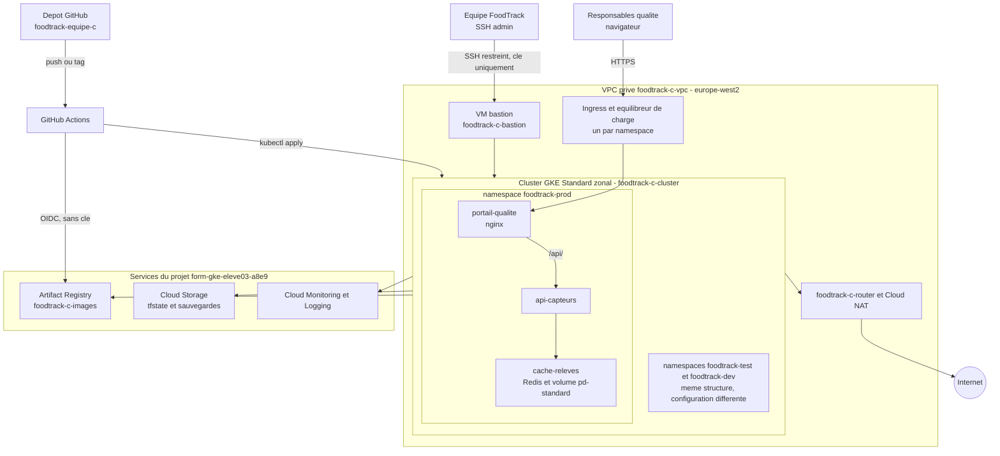

# FoodTrack — équipe C

Projet final — Ingénieur Cloud OPS — DevOps multicloud.
Projet Google Cloud : `foodtrack-equipe-c` · Région : `europe-west2` · Entrepôt : Londres.

> Énoncé complet : [`projet-final/CAHIER_DES_CHARGES.html`](projet-final/CAHIER_DES_CHARGES.html)
> Grille de soutenance : [`projet-final/GRILLE_SOUTENANCE.html`](projet-final/GRILLE_SOUTENANCE.html)

## Équipe et rôles

| Rôle | Domaine | Porte aussi | Membre |
|---|---|---|---|
| Lead infrastructure | VPC, NAT, cluster, bastion, buckets, modules Terraform | Documentation d'architecture | _à compléter_ |
| Lead Kubernetes | Manifestes, namespaces, configuration par environnement, exposition, mise à l'échelle | | _à compléter_ |
| Lead livraison | Dépôt, workflow GitHub Actions, Artifact Registry, versions et releases | | _à compléter_ |
| Lead exploitation | Supervision, alertes, IAM, durcissement, scripts, coûts | Script Python de contrôle de santé | _à compléter_ |

(Équipe de 4 : pas de rôle Coordination dédié — la documentation d'architecture revient au Lead infrastructure, le script de santé au Lead exploitation.)

## Structure du dépôt

```
terraform/            racine Terraform : backend gcs, variables, modules
  modules/
    reseau/            vpc, sous-reseau, cloud router, cloud nat, pare-feu
    compute/           cluster gke, node pool, vm bastion
    stockage/          buckets de sauvegarde et d exports de journaux
    wif-github/         federation d identite GitHub Actions -> Google Cloud (fourni)
  dev.tfvars / test.tfvars / prod.tfvars

labs/projet-final/     ressources fournies par le formateur (point de depart)
  manifests/            manifestes Kubernetes de depart (namespace unique)
  terraform-fourni/     module WIF original tel que fourni
  ci/                    squelette de workflow GitHub Actions

manifests/              (a creer) manifestes organises par environnement
  dev/ test/ prod/       ou base/ + overlays/ si Kustomize

.github/workflows/     pipeline CI/CD

projet-final/          cahier des charges et grille de soutenance (reference)
assets/                 logos et schemas
```

## Démarrage

```bash
export EQUIPE="c"
export REGION="europe-west2"
export ZONE="europe-west2-b"
export PROJECT="poei-formation-gcp"

gcloud config set project "$PROJECT"
gcloud config set compute/region "$REGION"
gcloud config set compute/zone "$ZONE"
```

## Bucket d'état Terraform (exception documentée)

Créé à la main, une fois, avant le premier `terraform init` — seule exception à la règle « tout en Terraform ».

```bash
gcloud storage buckets create "gs://foodtrack-c-tfstate-${PROJECT}" --location="$REGION" --uniform-bucket-level-access
gcloud storage buckets update "gs://foodtrack-c-tfstate-${PROJECT}" --versioning
```

## Dimensionnement du cluster

_À chiffrer et justifier ici avant le premier `terraform apply` du module `compute` : somme des `resources.requests` des 3 tiers × 3 environnements + marge système._

## Analyse de coûts

_À compléter en phase 4._

## Choix techniques et arbitrages

_À documenter au fil du projet — c'est ce que le jury lit avant la soutenance._


